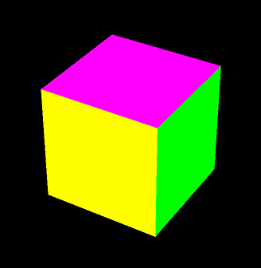
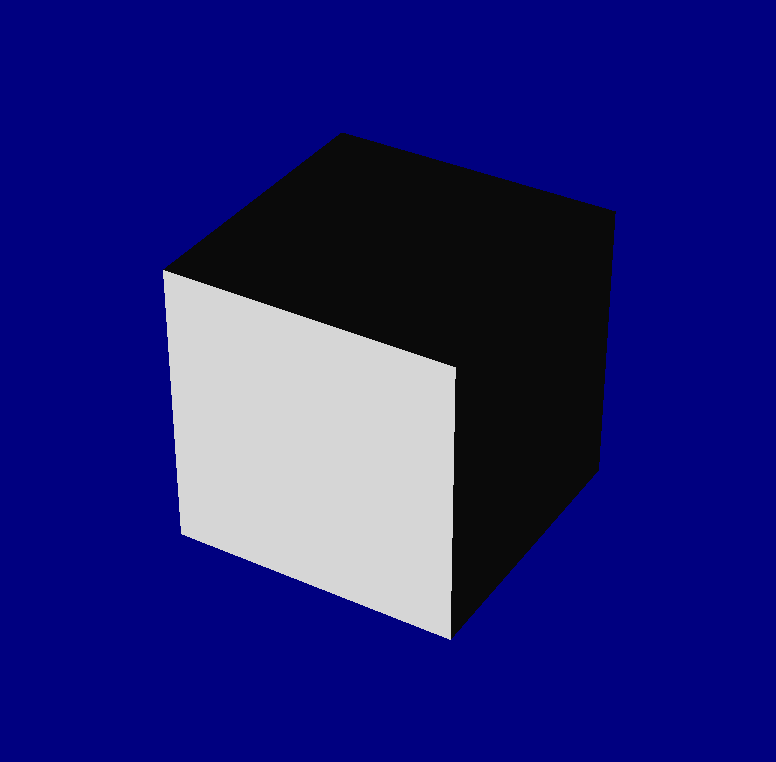
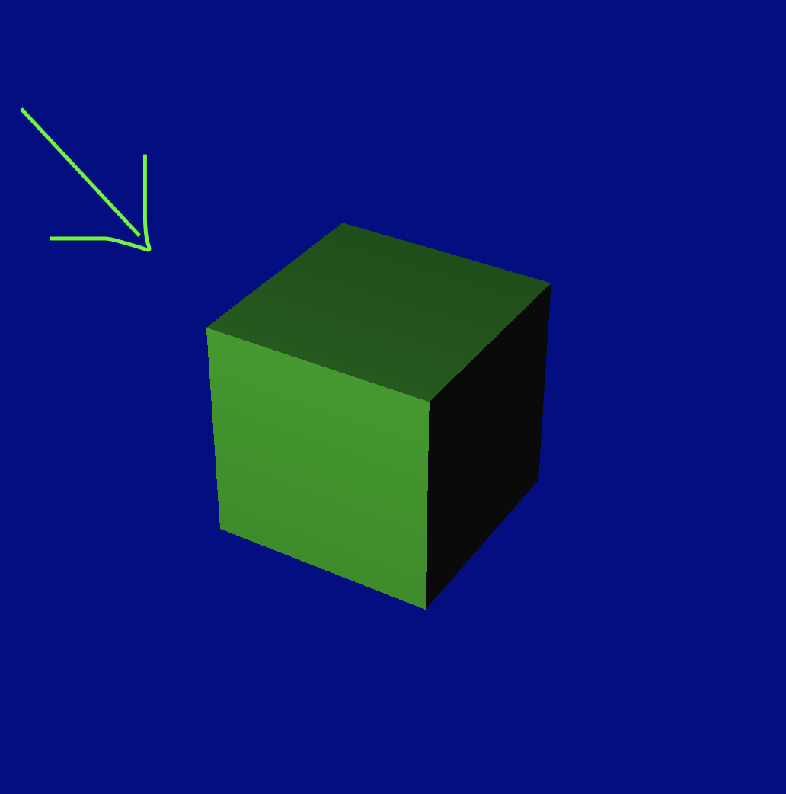
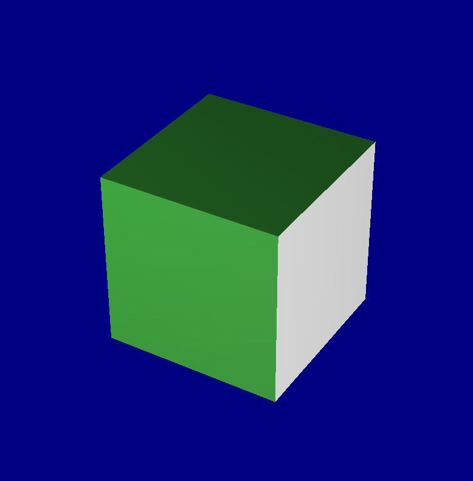
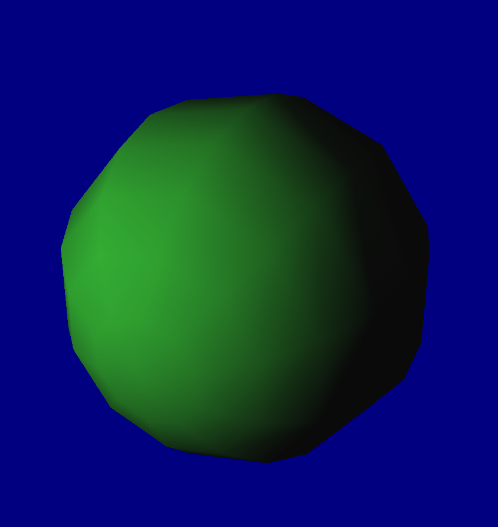
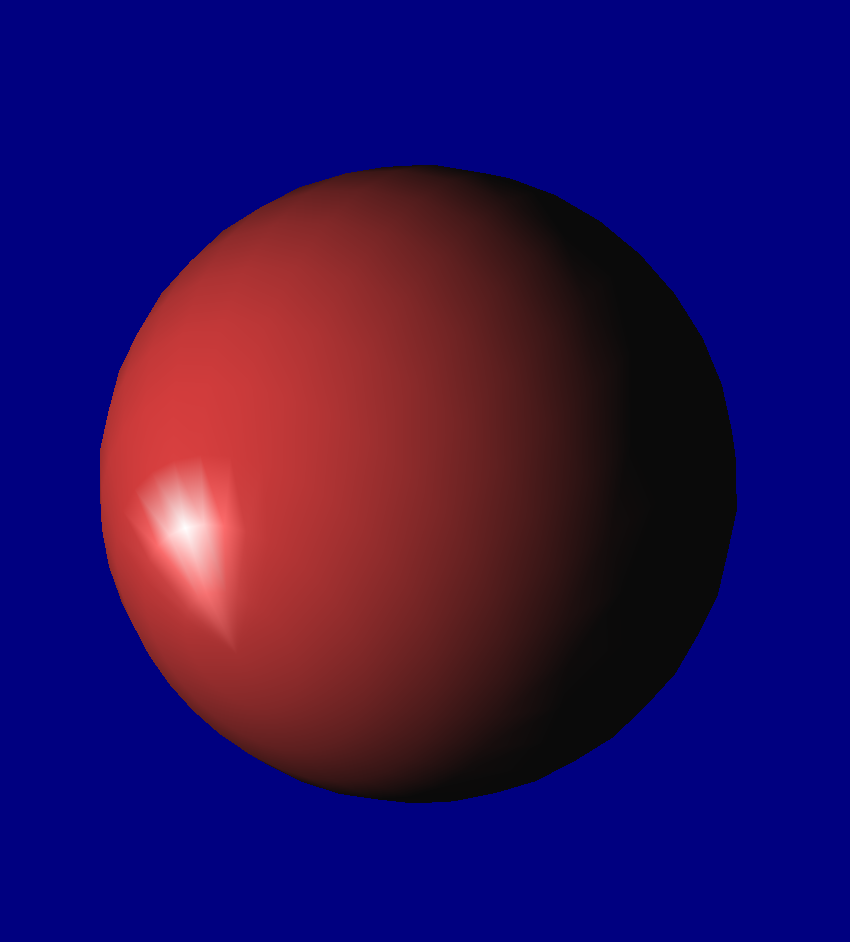

この資料は、従来版の第３回 - 3D 階層構造 に対応します。

## 目次
* [準備](#準備)
* [照明を当てよう](#照明を当てよう)
	* [照明の位置と色](#照明の位置と色)
	* [複数の光源をつかう](#複数の光源をつかう)
* [材質の設定](#材質の設定)
	* [法線の話](#法線の話)
	* [色と質感](#色と質感)
* [課題1](#課題1)
* [課題2](#課題2)
* [課題3](#課題3)
* [オブジェクトいろいろ](#オブジェクトいろいろ)


## 準備
ここのコードをダウンロード、解凍してください。sample.xcodeproj を開き実行すると図のような立方体が表示されることを確認してください。




## 照明を当てよう
現在はポリゴンごとに一定の色で描画されているだけですが、照明を当てることにより陰影を表現するようにプログラムを書き換えていきます。

[ main.cpp - myinit関数 ]
```cpp
void myinit(GLFWwindow** window)
{
    glfwInit();
    
    int w = 600;
    int h = 600;
    *window = glfwCreateWindow(w, h, "material", NULL, NULL);
    glfwMakeContextCurrent(*window);
    
    glClearColor(0, 0, 0.5, 1); // みやすいように、背景色を青に設定
    glEnable(GL_DEPTH_TEST);
    
    glEnable( GL_LIGHTING ); // 照明の有効化
    glEnable( GL_LIGHT0 );　// 一つの光源を設置

    reshape(*window, w, h);
}
```
これで実行してみると、手前から照明の当たった立方体が表示されます。材質の設定をしていないため立方体の色が白くなってしまいましたが、これは後でやります。



### 照明の位置と色
追加した光源の位置や色を設定することができます。
例として、(白い)立方体の左上から、緑の光源で照らすように`display`関数を次のように書き換えます。



```cpp
void display()
{
    glClear(GL_COLOR_BUFFER_BIT | GL_DEPTH_BUFFER_BIT); // 色と深度の初期化

    glMatrixMode(GL_MODELVIEW);
    glLoadIdentity();
    
    // 使う色を用意
    float green[] = { 0.2f, 0.8f, 0.2f, 1.0f };
    float red[] = { 0.8f, 0.2f, 0.2f, 1.0f };
    float white[] = { 1.0f, 1.0f, 1.0f, 1.0f };
    
    // 光源0 の設定
    float lightpos0[] = { -2.0f, 3.0f, 5.0f, 1.0f };

    glLightfv( GL_LIGHT0, GL_POSITION, lightpos0 );
    glLightfv( GL_LIGHT0, GL_DIFFUSE, green );

    // 立方体を描画
    makebox(1.0,1.0,1.0,GL_POLYGON);
}
```

`lightpos0`は位置を記録するために作った変数で、左の３つはx, y, z 座標です。最後の`1.0f`は同次座標に使う実数ですが、とりあえず1にすると思っていいです。<br>
`green`は色を記録するために作った変数で、左からR, G, B, alpha 値です。

そして、下のほうで`glLightfv`関数を用いてこれらの変数を光源に設定していきます。<br>
引数は `glLightfv(光源名, 設定項目, 位置や色の値)` です。

### 複数の光源をつかう
複数の光源を使うには `myinit` のほうで新たな光源を有効にし、設定を行います。

[ main.cpp - myinit 関数 ]
```cpp
glEnable( GL_LIGHTING );
glEnable( GL_LIGHT0 );
glEnable( GL_LIGHT1 ); // LIGHT 1 を有効にする
```

[ main.cpp - draw 関数 ]
```cpp
// 光源0 の設定
float lightpos0[] = { -2.0f, 3.0f, 5.0f, 1.0f };

glLightfv( GL_LIGHT0, GL_POSITION, lightpos0 );
glLightfv( GL_LIGHT0, GL_DIFFUSE, green );

// 光源1 の設定を追加
float lightpos1[] = { 5.0f, 0.0f, 1.0f, 1.0f };

glLightfv( GL_LIGHT1, GL_POSITION, lightpos1 );
glLightfv( GL_LIGHT1, GL_DIFFUSE, white );
```

左上の緑の光源に加えて、右側に白い光源を配置しました。<br>



## 材質の設定
照明の計算を有効にしたことでもともと設定していたポリゴンの色が見えなくなってしまったので、新たに材質の設定をおこなっていきます。OpenGL における照明は、光源の位置と面の向き(法線)、面の色などをもとに計算されるので、これらを設定していきます。

### 法線の話
法線とは物体面の向きを表すベクトルのことで、光源からどれくらいの光が当たるかという陰影の計算に使われます。立方体の法線はmakebox の中に書いてあります。

[ box.cpp - makebox 関数内 ]
```cpp
//前面描画・黄
glColor3d(1.0, 1.0, 0.0);
glNormal3d(0, 0, 1); // ←法線の設定
glBegin(type);
    glVertex3dv(box[0]);
    glVertex3dv(box[1]);
    glVertex3dv(box[2]);
    glVertex3dv(box[3]);
glEnd();
```

`glNormal3d()` で法線の設定をしています。これは手前の面なので、面の向きは z+ 方向ということになります。

余談になりますが、法線と陰影の効果をみるため、球体を表示してみましょう。`display` を以下のように書き換えます。

```cpp
void display()
{
    glClear(GL_COLOR_BUFFER_BIT | GL_DEPTH_BUFFER_BIT); // 色と深度の初期化

    glMatrixMode(GL_MODELVIEW);
    glLoadIdentity();
    
    // 使う色の用意
    float green[] = { 0.2f, 0.8f, 0.2f, 1.0f };
    float red[] = { 0.8f, 0.2f, 0.2f, 1.0f };
    float white[] = { 1.0f, 1.0f, 1.0f, 1.0f };
    
    // 光源0 の設定
    float lightpos0[] = { -2.0f, 3.0f, 5.0f, 1.0f }; // 位置

    glLightfv( GL_LIGHT0, GL_POSITION, lightpos0 );
    glLightfv( GL_LIGHT0, GL_DIFFUSE, green ); // 光源色にgreen を設定
    

    // 追記 ---------------------------------------------------
    GLUquadric* sphere = gluNewQuadric();    //オブジェクトを生成
    gluSphere(sphere, 1.0 , 32, 16); //球を描画
    // 追記おわり -----------------------------------------------
    
   	// makebox(1.0,1.0,1.0,GL_POLYGON); // 立方体は表示しない
}
```
球体のパラメータは`gluSphere(オブジェクト, 半径 , 経度方向の解像度, 緯度方向の解像度)`となっています。実行すると、球の面の向きによって陰影がついていることが確認できます。



### 色と質感
照明計算を有効にするときは、物体の材質を`glMaterialfv`関数で設定します。

```cpp
void display()
{
    glClear(GL_COLOR_BUFFER_BIT | GL_DEPTH_BUFFER_BIT); // 色と深度の初期化

    glMatrixMode(GL_MODELVIEW);
    glLoadIdentity();
    
    // 使う色の用意
    float green[] = { 0.2f, 0.8f, 0.2f, 1.0f };
    float red[] = { 0.8f, 0.2f, 0.2f, 1.0f };
    float white[] = { 1.0f, 1.0f, 1.0f, 1.0f };
    
    // 光源0 の設定
    float lightpos0[] = { -2.0f, 3.0f, 5.0f, 1.0f };
    
    glLightfv( GL_LIGHT0, GL_POSITION, lightpos0 );
    glLightfv( GL_LIGHT0, GL_DIFFUSE, white ); // 光源は白に
    
    // 材質
    glMaterialfv( GL_FRONT_AND_BACK, GL_DIFFUSE, red ); // 赤い拡散反射を設定

    // 球の表示
    GLUquadric* sphere = gluNewQuadric();
    gluSphere(sphere, 1.0, 32, 16);
}
```
使い方としては、 glColor3d(); と同じですね。３つのパラメータはそれぞれ、<br>
`glMaterialfv(材質の適用する部分[＝表裏両面],　設定する材質の種類,　設定項目の引数)` です。

2番目の引数である "設定する材質の種類" には以下のようなものがあり、対応して3番目の引数を与えます。

|パラメータ|意味|3番目に与える引数|
|:-|:-:|:-:|
|GL_DIFFUSE|拡散反射|色|
|GL_SPECULAR|鏡面反射|色|
|GL_EMISSION|発光|色|
|GL_SHININESS|反射の鋭さ|数値 (0～128)|

例えば、拡散反射を赤、鏡面反射を白、鋭い鏡面反射を設定するには以下のように書きます。



```cpp
glMaterialfv( GL_FRONT_AND_BACK, GL_DIFFUSE, red );
glMaterialfv( GL_FRONT_AND_BACK, GL_SPECULAR, white);
glMaterialf( GL_FRONT_AND_BACK, GL_SHININESS, 120 );
```

ちなみに、色のalpha値を小さくすると半透明を表現できます。

`float red[] = { 0.8f, 0.2f, 0.2f, 0.5f };`


## 課題1
下の画のように材質(色)を設定して下さい。


立方体の面や頂点ごとに材質を設定するためには、box.cpp にある `makebox`関数を書き換えてください。

## 課題2
鏡面反射を設定して、以下のような画面を作ってください。


## 課題3
前回までに自分の作ったロボットに質感設定をしてください。


## オブジェクトいろいろ
途中で球体を表示しましたが、ほかにも基本的なオブジェクトが用意されています。

|オブジェクトの種類|関数|
|:-:|:-|
||gluSphere(オブジェクト, 半径, 経度方向の分割数, 緯度方向の分割数)|
||gluCylinder(オブジェクト, 底面の半径, 上面の半径, 高さ, 円周方向の分割数, 縦の分割数)|
||gluDisk(オブジェクト, 内の半径, 外の半径, 円周の分割数, 半径の分割数)|
||gluPartialDisk(オブジェクト, 内の半径, 外の半径, 円周の分割数, 半径の分割数, 開始角度, 扇の角度)|ed(180, 0, 1, 0);
            makebox(0.3, 0.05, 1.2, GL_POLYGON);
        glPopMatrix();

        glPushMatrix(); // --- 口
            glTranslated(0, -0.2, 0);
            glRotated( 180, 0, 1, 0);
            makebox(0.7, 0.05, 1.2, GL_POLYGON);
        glPopMatrix();
    glPopMatrix(); // 頭おわり


    glPushMatrix();  //-- 右足
        glTranslated(-0.35, -1.2, 0);
        makebox(0.3, 1, 1, GL_POLYGON);
    glPopMatrix();


    glPushMatrix();  //-- 左足
        glTranslated( 0.35, -1.2, 0);
        makebox(0.3, 1, 1, GL_POLYGON);
    glPopMatrix();


    glPushMatrix();  //-- 右腕
        glTranslated(-1.2, 0.35, 0);
        makebox(1, 0.3, 1, GL_POLYGON);
    glPopMatrix();


    glPushMatrix();  //-- 左腕
        glTranslated( 1.2, 0.35, 0);
        makebox(1, 0.3, 1, GL_POLYGON);
    glPopMatrix();

glPopMatrix();

```
</details>
